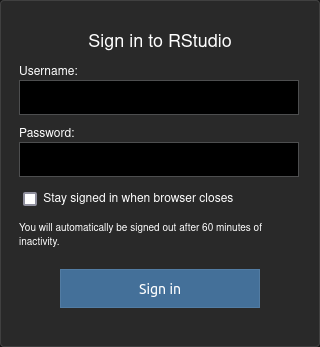
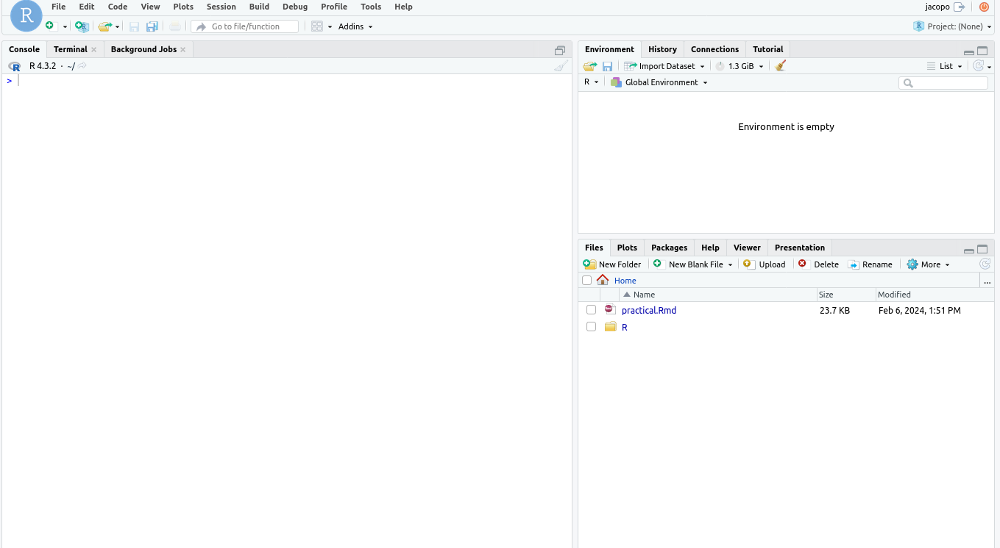
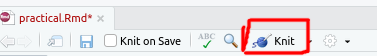
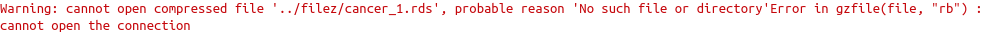
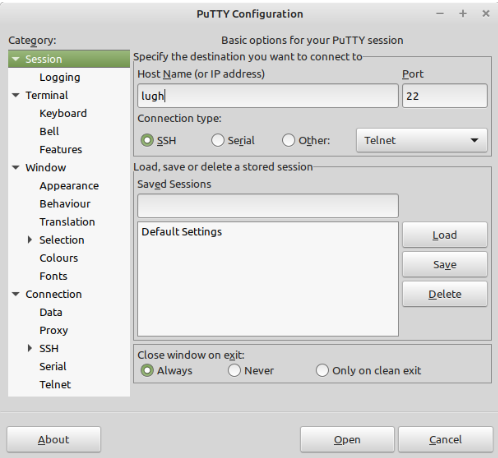

# MA5112 - Practical 4 (scRNA-Seq)

In this practical session, we'll focus on single-cell RNA sequencing (scRNA-Seq), a technique for analyzing gene expression at the individual cell level. Our dataset comprises samples from both healthy individuals and patients diagnosed with Multiple Myeloma, all originating from bone marrow. Throughout our analysis, we'll cover the essential components of scRNA-Seq analysis, including data preprocessing, quality control, cell labelling, batch correction, dimensionality reduction, visualization and differential expression analysis.

To facilitate our analysis, we'll connect to an RStudio Server, so it will provide us an IDE and an already set-up environent with all the packages needed already installed.

## Step1 - login to the Rstudio server

To connect to the Rstudio server, from a browser web go to the IP: `185.175.168.73`. You will be prompted to a login page, use the same credentials you use to login in `lugh` to access a new Rstudio session:

- Username: msc...
- Password: your passowrd





After logging in, you will see a new Rstudio session.




## Step2 - Open the practical notebook

Open the file `practical.Rmd`, you will see the `Rmd` file has already been setup with your email. add your name instead of `name` to be sure you are the author of the notebook. So, if your name is `Foo Bar`, the line shoud be:
```
    - Foo Bar^[f.bar1@universityofgalway.ie]
```


## Step3 - Follow the notebook

The notebook includes all the steps needed to carry on the analysis, you will be asked to answer some question and input some cell type of interest. Follow the instructions and, once happy with the result, knit the notebook to obtain your assignment.



**NOTE:** if you don't complete the assignment the notebook will fail! so pleae be sure all the code chink run correctly before knitting.

**NOTE2** the notebook includes the links for the website/documentation of the main pagkages used, if you have issues, you are invited to <ins>read and understand the error</ins> and <ins>read the documentation</ins>.

e.g.


You are trying to open a file and it resulted in an error. The warning says that probably that file doesn't exist. Is the filename correct? and the path?

Eventually you can try [this](https://chat.openai.com/share/638c8b9d-ab3e-41a2-9d6b-2caaf0e69644)

## Step4 - Get your assignment

As you can see, we aren't working on `lugh`. Indeed to run the RStudio server we decided to utilize a cloud provided different from AWS.

Now is the time to download you assignment to your local machine and submit it. Here a pair of issues comes:
- To keep a certain level of security we can allow only some IPs to connect to the port 22 (the one used by `ssh`)
- The school firewall doesn't allow us to connect to the IP of the VM with an ssh connection (PuTTY)

The solution to the probles is to:
1. Log into `lugh` with PuTTY as you did in the last 3 weeks

    - remember to go into a compute node to run any command. Running jobs or commands form the login node disrupt the activity of all the other users.
2. Copy the file from the VM to `lugh`. To do so there are several options, the one we are going to use today is [`scp`](https://en.wikipedia.org/wiki/Secure_copy_protocol). The secure copy protocol (scp) uses `ssh` for data transfer. Thus, the `scp` command uses the same authentication and provides the same security as the `ssh` command.

```
## example of scp syntax
scp yourusername@yourserver:/home/yourusername/yourassignment.html ./

## in our case it will be something like:
scp foobar@185.175.168.73:/home/foobar/practical.html ./

## REMEMBER TO ADAPT THE COMMAND TO YOUR SPECIFIC CASE
```

3. Move the file to your local machine with WinSCP as we did in the last 3 weeks
4. Remove the file we copied in `lugh` to keep the `home` directory free and don't dirsupt the activity of other users

**NOTE** if you aren't sure of the location of your file or your username there are some basic bash commands that will help you:
- `pwd`: Gives you the absolute path where you are 
- `readlink`: give you the absolute path of a specific file
- `whoami`: output the username
- Others can be easily found online

